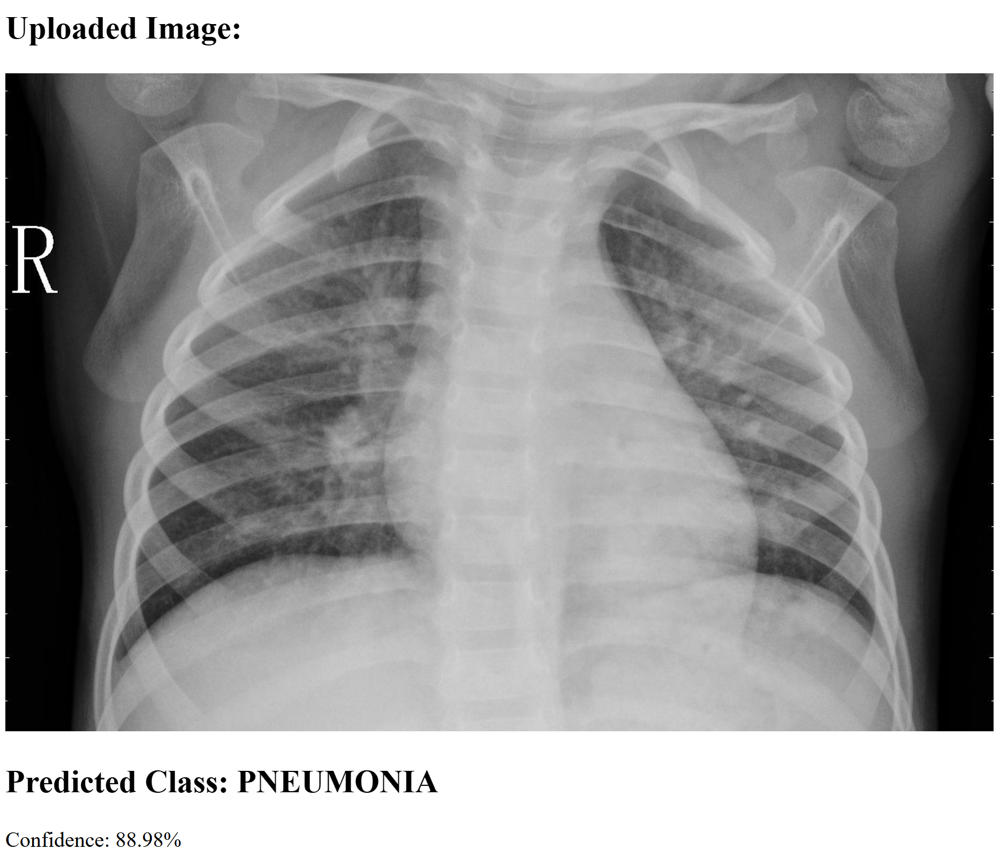
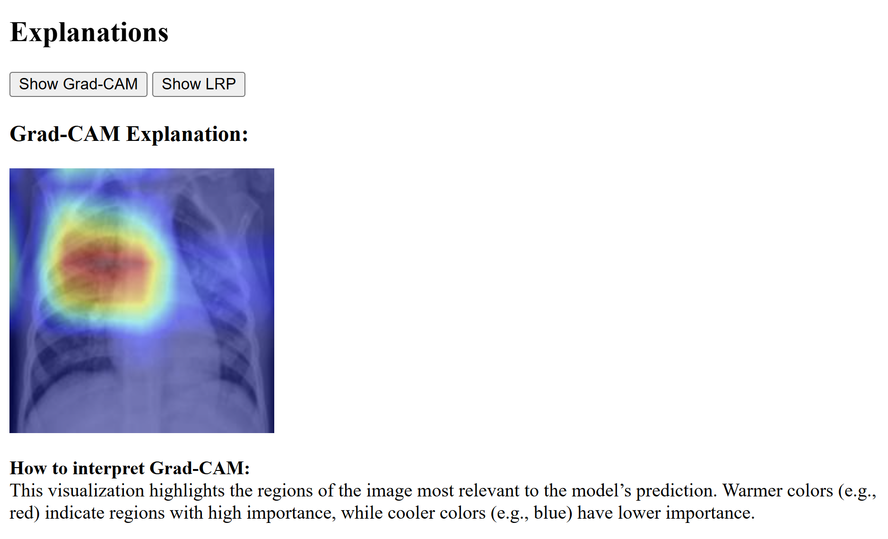
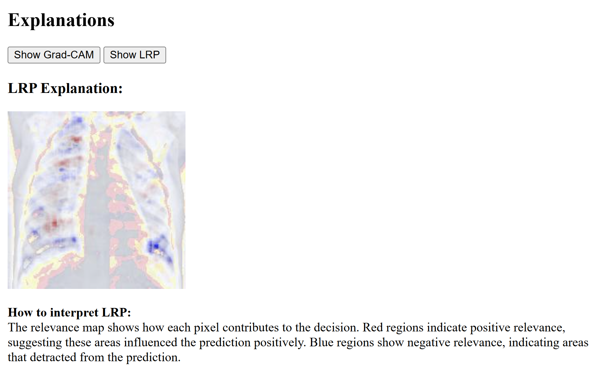

# XAI-Dashboard-Pneumonia-Detection
This is a simple local web application that displays a dashboard with eXplainable Artificial Intelligence (XAI) explanations. The model being explained is a deep learning image classification model that predicts whether a patient has pneumonia or is healthy from chest X-ray images.

The application can be loaded by running <i>dashboard.py</i>. You will see a localhost port being opened (commonly port 5001) via the terminal. Simply ctrl + click to access the application from your web browser.

To test the functionality of the dashboard, a chest X-ray image has to be uploaded. A sample image (<i>sample_xray.jpeg</i>) is provided in this repository.

After uploading, the image will be displayed, along with the predicted class (PNEUMONIA or NORMAL) and the model's confidence. It will look something like this:

The buttons on the right-hand side are the explanations generated by Gradient-weighted Class Activation Mapping (Grad-CAM) and Layerwise Relevance Propagation (LRP) respectively. Click on either button to show the image visualization and a textual description of how to interpret it.

An example of a Grad-CAM explanation would look like:

and an example of a LRP explanation would look like:

